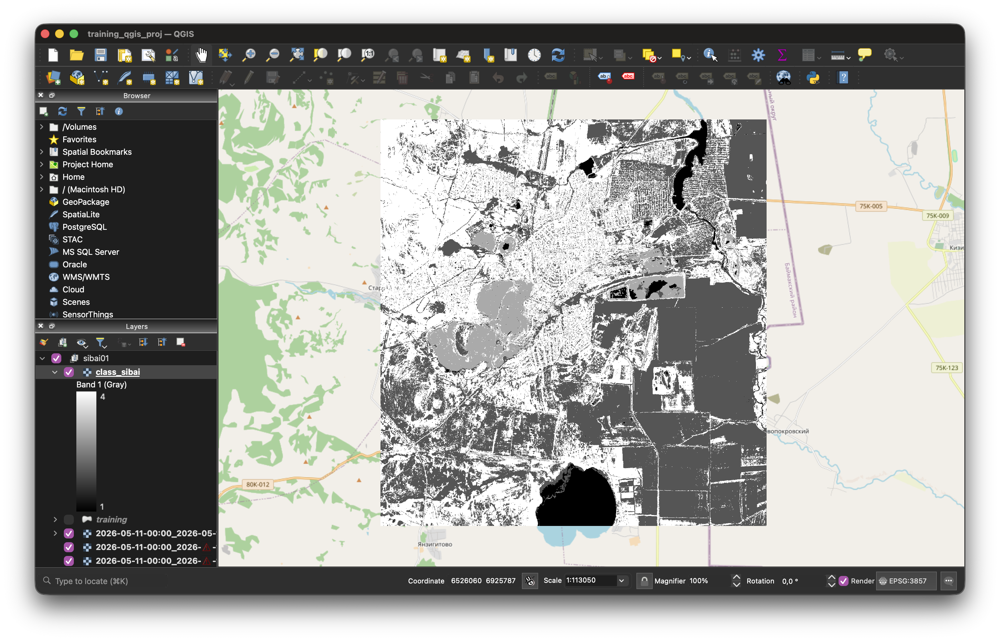

# Automatic Quarry Detection Using Sentinel-2 and SVM

A university coursework project demonstrating pixel-based land cover classification using Sentinel-2 multispectral imagery and a Support Vector Machine (SVM).

The project uses spectral bands from Sentinel-2, extracts training samples from labeled polygons, trains an SVM classifier, and produces a classified raster map.



## Features

- Sentinel-2 multispectral data processing
- Training sample extraction from vector polygons
- SVM-based classification using scikit-learn
- GeoTIFF output generation
- Basic accuracy assessment and confusion matrix export

## Requirements

- Python 3.10+
- rasterio
- geopandas
- numpy
- pandas
- scikit-learn

Install dependencies:

```bash
pip install -r requirements.txt
```

## Workflow

1. Prepare Sentinel-2 bands (`B02`, `B03`, `B04`, `B08`)
2. Create training polygons with class labels
3. Extract training samples
4. Train the SVM model
5. Classify the raster
6. Analyze the results

## Project Structure

```text
scripts/
├── prepare_samples.py
├── merge_samples.py
├── train_svm.py
└── classify_raster.py

docs/
└── report_draft.md

data/
models/
outputs/
```

## Status

This repository contains a university coursework project and is preserved primarily for reference purposes.

The code is provided as-is and has not been actively maintained since the completion of the coursework.
